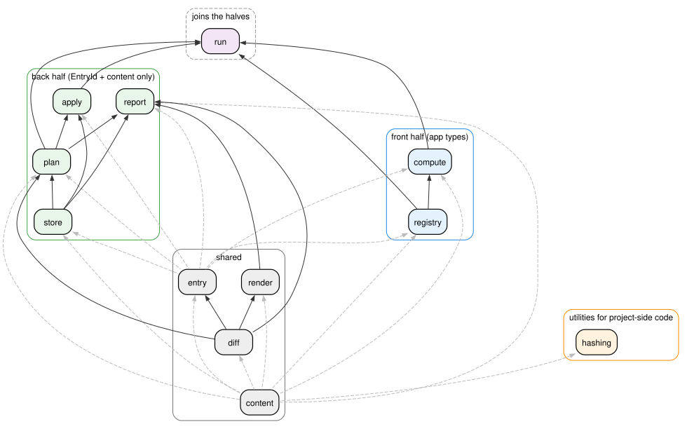
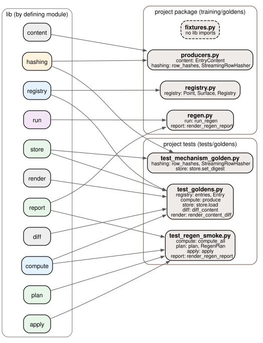

# Goldens library, pass 1: interface map

Working map for reviewing the module structure. It reflects 9.26-2 plus the decisions from the 9.30 session. Nothing here is built.

## Layers

```
project side      registry.py   fixtures.py   producers.py   regen.py   paths.py
                        │  imports only the public API (training.goldens.lib)
                        ▼
lib/ ┌──────────────────────────────────────────────────────────────────────┐
     │ joins the halves   run                                               │
     │                                                                      │
     │ front half         registry   compute                                │
     │ back half          store   plan   apply   report                     │
     │                                                                      │
     │ shared             content   entry   diff   render                   │
     │                                                                      │
     │ utilities for      hashing                                           │
     │ project-side code                                                    │
     └──────────────────────────────────────────────────────────────────────┘
```

The front half knows the app's types (configs, fixtures, loaded data). The back half sees only `EntryId` and content. The shared modules are plain data types and pure functions used by both. `hashing` is used only by project-side code (the producers and tests): the library's pipeline receives `RowHashes` values inside content but never hashes anything itself.


## Module layout

```
training/goldens/
  lib/
    __init__.py      # public API
    content.py       # EntryContent, ArrayLayout, RowHashes, layout_of, row_data, check_content, content ids
    entry.py         # EntryId, FixtureInfo, ComputedEntry, statuses, PlannedEntry
    hashing.py       # row_hashes, StreamingRowHasher (both return RowHashes)
    diff.py          # ArrayChange union, ContentDiff, diff_content
    render.py        # render_rows, render_change, render_content_diff
    registry.py      # Point, Surface, Registry, Entry, entries(), fixture_infos()
    store.py         # paths, scan, load, save, remove, serialize, set_digest
    compute.py       # produce, compute_all
    plan.py          # SurfacePlan, RegenPlan, plan, classify, match_moves
    apply.py
    run.py           # run_regen
    report.py        # render_regen_report
  registry.py        # project points, fixtures, REGISTRY
  fixtures.py        # FixtureRecord, FixtureData, load_fixture
  producers.py       # produce_obs, produce_supervision
  paths.py
  regen.py           # the command line
```

## Import graph inside lib



*Diagram source: sibling `.dot` file next to the svg.*

An arrow A → B means B imports A: arrows point from a module to the modules that use it. Imports of the base types (`content`, `entry`) are dashed and gray. No import runs between the front half and the back half: `ComputedEntry`, the record passed from one to the other, lives in the shared `entry` module, and `run` is the only module that imports both halves.

The same graph as text, where each line lists what a module imports from other lib modules:

```
content    (none)
diff       content
entry      content, diff (Changed holds a ContentDiff)
hashing    content
render     content, diff
registry   content, entry
store      content, entry
compute    content, entry, registry
plan       content, diff, entry, store
apply      entry, plan, store
report     content, diff, entry, plan, render, store (store only for rel_path in "moved from" lines)
run        registry, compute, plan, apply
```

## What the project side uses from lib



*Diagram source: sibling `.dot` file next to the svg.*

Project code imports everything through `lib/__init__.py`. Here each arrow starts at the lib module that defines the names, and each project node lists the names it uses, one line per lib module.

The project package itself uses five lib modules: `registry`, `content`, and `hashing` to define its surfaces and producers, and `run` and `report` for the command line. The wider use comes from the tests. `test_goldens.py` reaches into five modules for one comparison, and `test_regen_smoke.py` walks the regen pipeline one step at a time. Nothing on the project side uses `entry` directly.
