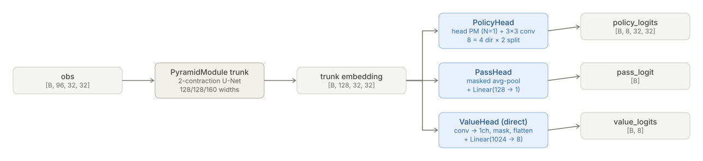
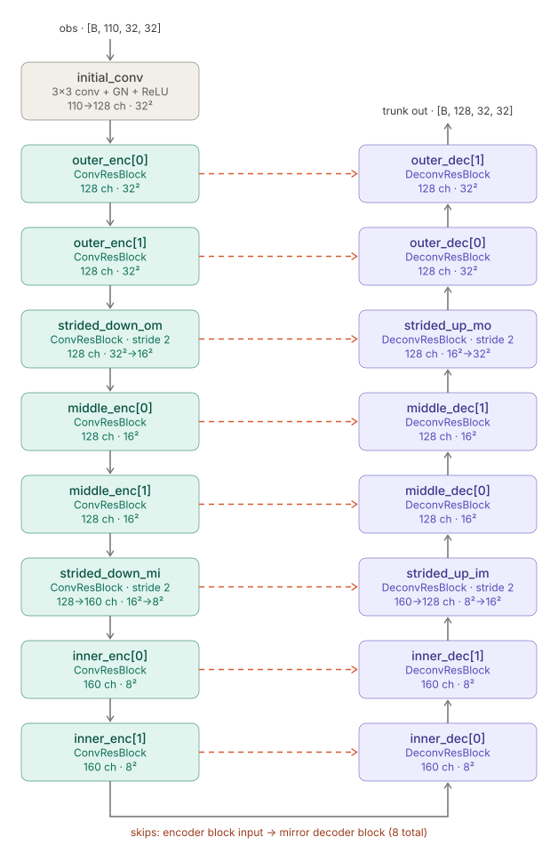
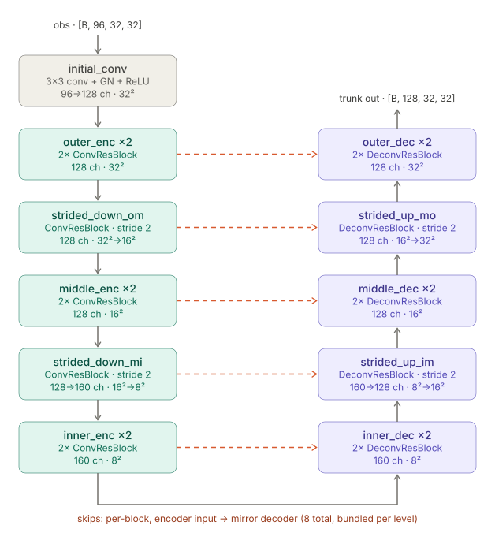

# Model architecture — `bc.model`

<!-- Generated by tools/gen_model_arch_doc.py from MODEL_CONFIG_DEFAULTS. Do not edit by hand. -->

## Overview

## Trunk — Pyramid Module (2-contraction U-Net)

Compact view — per-level ResBlock runs collapsed:

## Config

| field                                                 | value           |
|:------------------------------------------------------|:----------------|
| obs channels (`in_ch`)                                | 110             |
| board (H × W)                                         | 32 × 32         |
| trunk widths (outer / middle / inner)                 | 128 / 128 / 160 |
| trunk depths (N / M / M)                              | 2 / 2 / 2       |
| value head variant                                    | direct          |
| value head dropout — 2d / flat / skip-2d (train-time) | 0.0 / 0.0 / 0.0 |

## Parameters

| component     |        params |    share |
|:--------------|--------------:|---------:|
| `trunk`       |     3,056,016 |    72.7% |
| `policy_head` |     1,136,072 |    27.0% |
| `value_head`  |         9,353 |     0.2% |
| `pass_head`   |           129 |     0.0% |
| **total**     | **4,201,570** | **100%** |
